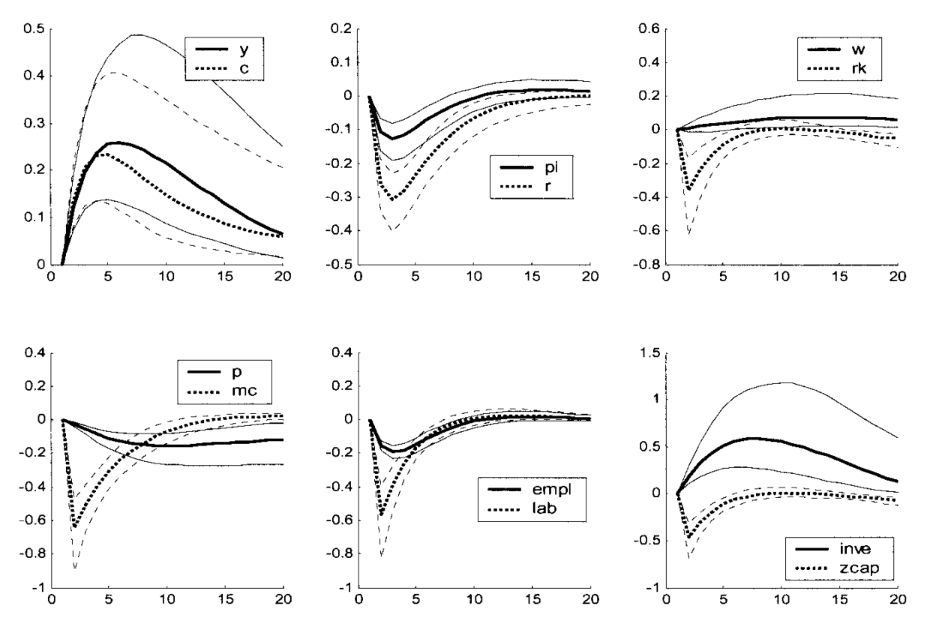
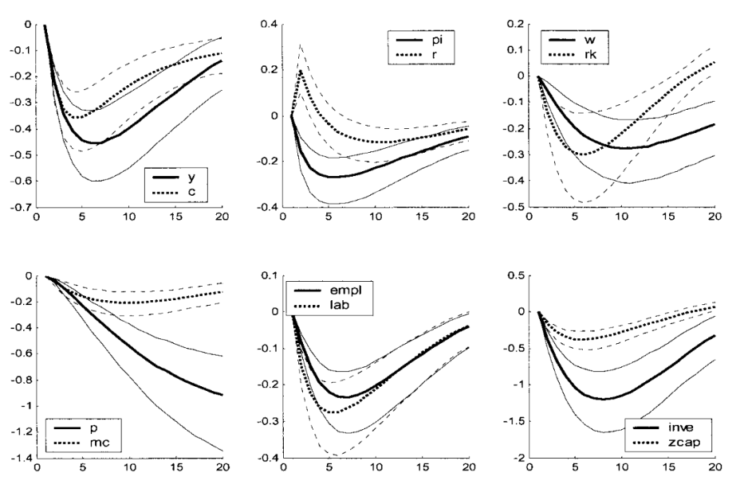
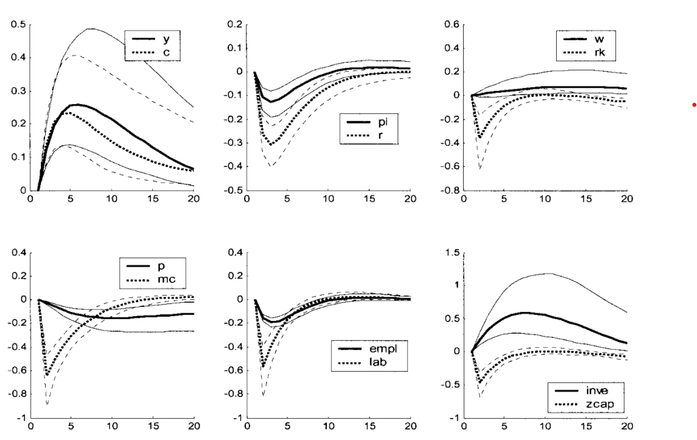
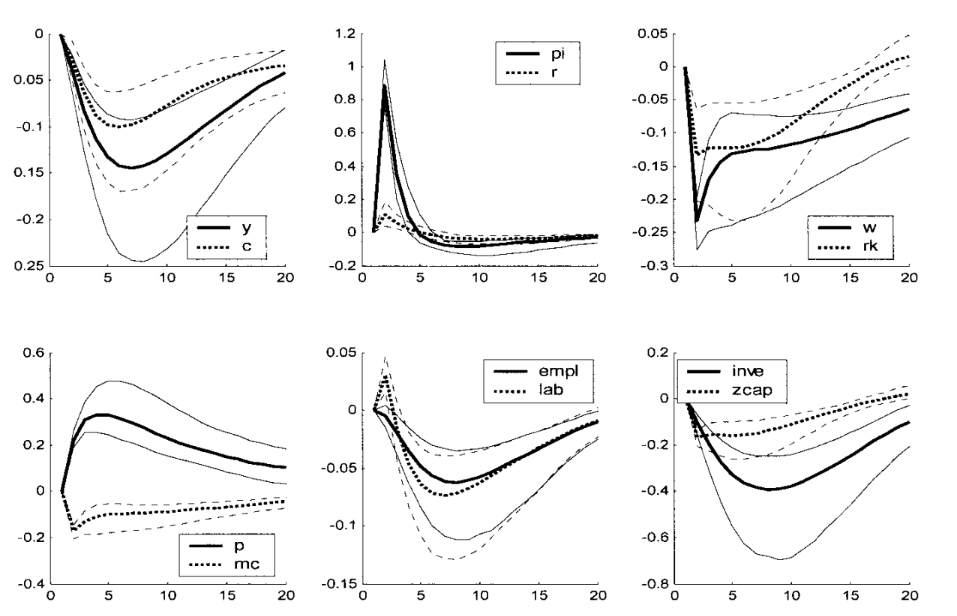
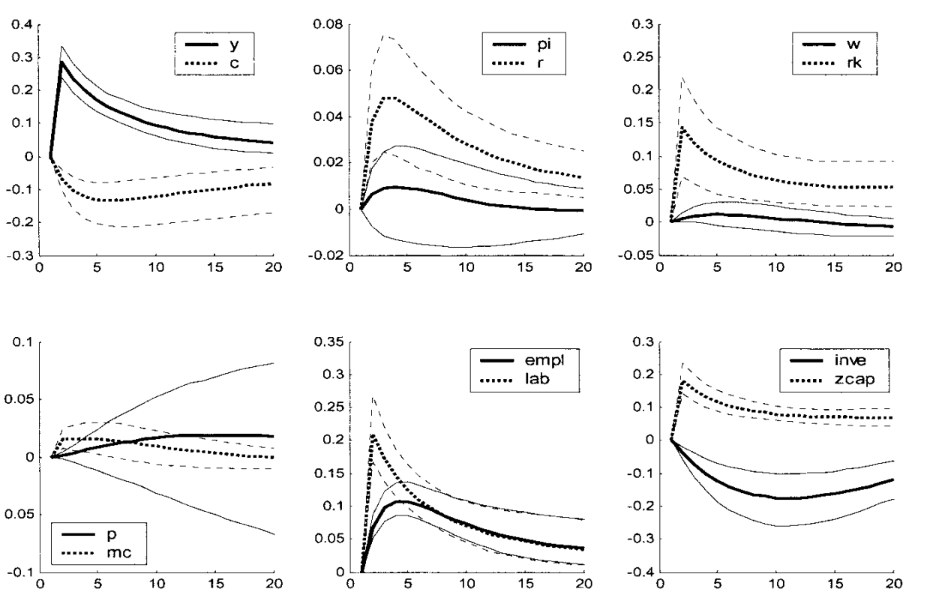

These notes follow the structure of Professor Silvia Miranda-Agrippino’s Empirical Macro course at Oxford.

Because I mainly state time-series concepts without developing them in detail, readers with little prior background in time series may find it useful to consult Hamilton (2005), especially Chapters 1–3 and 10–11.

Readers who are less comfortable with linear algebra may also benefit from skimming one of Gilbert Strang’s textbooks.

## Definitions

### Variables and Spaces

Throughout the text, we will use the following notation:

- $y_t \in \mathbb{R}^n$: vector of observable variables at time $t$.

- $\varepsilon_t \in \mathbb{R}^n$: vector of structural shocks at time $t$.

- $u_t \in \mathbb{R}^n$: vector of reduced-form innovations at time $t$.

Now let

$$
\mathcal H_t^y \equiv \overline{\operatorname{span}}\{y_{t-j}: j=0,1,2,\dots\} \subset L^2
$$

and

$$
\mathcal H_{t-1}^y \equiv \overline{\operatorname{span}}\{y_{t-j}: j=1,2,\dots\} \subset \mathcal H_t^y.
$$

Define the innovation space by

$$
\mathcal I_t^y \equiv \mathcal H_t^y \ominus \mathcal H_{t-1}^y
= \mathcal H_t^y \cap \left(\mathcal H_{t-1}^y\right)^\perp.
$$

Hence

$$
\mathcal I_t^y \perp \mathcal H_{t-1}^y.
$$

Under the absence of a deterministic component,

$$
\bigcap_{t=-\infty}^{\infty} \mathcal H_t^y = \{0\},
$$

and therefore

$$
\mathcal H_t^y
=
\mathcal I_t^y \oplus \mathcal I_{t-1}^y \oplus \mathcal I_{t-2}^y \oplus \cdots.
$$

### Structural shocks

Structural shocks are primitive exogenous disturbances, assumed to be mutually uncorrelated and to admit an economic interpretation.  
From this definition it follows that shocks must possess these properties:

- exogeneity wrt to the variables of the model
- orthogonality between them
- orthogonality wrt to the span of lagged variables of the model

For these reasons, we usually define the shocks as:

$$
\varepsilon_t \sim WN(0, I).
$$

If we define observed variables of interest as $y_t$, then a structural representation may be written as:

$$
y_t = \Theta(L)\varepsilon_t,
$$

where $\Theta(L)$ is a matrix lag polynomial, which implies that

$$
y_t \in \mathcal H_t^\varepsilon.
$$

The representation above will not be derived here. Intuitively, it states that the realization of the variables of interest at time $t$ can be decomposed into the contemporaneous and lagged effects of structural shocks. In this sense, current observables are generated by the propagation over time of present and past shocks through the linear operator $\Theta(L)$.  

### VMA representation

Define a vector moving-average representation as:

$$
y_t = \mu + \sum_{h=0}^{\infty} \Theta_h u_{t-h}, \quad u_t \sim W N(0, \Sigma) .
$$

We will also write:

$$
y_t= \mu + \Theta (L) u_t
$$

Notice that if we define:

$$
x_t \equiv y_t - \mu,
\qquad
\mu \equiv \mathbb E[y_t].
$$

the process becomes

$$
x_t = \Theta(L)\varepsilon_t
=
\sum_{j=0}^\infty \Theta_j \varepsilon_{t-j}.
$$

and so we can view the VMA as a projection:

$$
x_t \in \mathcal H_t^\varepsilon.
$$

### VAR representation

Define a vector auto regressive $VAR(\infty)$ representation as:

$$
y_t=\nu+\sum_{\ell=1}^{\infty} A_{\ell} y_{t-\ell}+u_t, \quad u_t \sim W N(0, \Sigma) .
$$

Note that this infinite order VAR can be approximated by a finite order $VAR(p)$, provided that $A(L)^{-1}$ exists and is absolutely summable:

$$
y_t=\nu+\sum_{\ell=1}^p A_{\ell} y_{t-\ell}+u_t, \quad u_t \sim W N(0, \Sigma) .
$$

where $p$ represents the number of lags.

We will also write:

$$
A(L) y_t=\nu+u_t
$$

Let $x_t = y_t-\mu$. Under covariance stationarity, the mean satisfies

$$
\mu = c + A_1\mu + \cdots + A_p\mu,
$$

equivalently,

$$
(I-A_1-\cdots-A_p)\mu = c.
$$

if we define $x_t = y_t-\mu$, it follows that

$$
x_t = A_1 x_{t-1} + \cdots + A_p x_{t-p} + u_t.
$$

Then again the fitted part

$$
A_1 x_{t-1} + \cdots + A_p x_{t-p}
$$

is the linear projection of $x_t$ onto its past, namely

$$
\operatorname{Proj}_{\mathcal H_{t-1}^x}(x_t).
$$

Hence the innovation is

$$
u_t
=
x_t - \operatorname{Proj}_{\mathcal H_{t-1}^x}(x_t),
$$

and therefore

$$
u_t \perp \mathcal H_{t-1}^x.
$$

### Impulse response functions

The impulse response function measures the effect of a shock at time $t$ on future values of the observables $y_t$.

If

$$
y_t = \Theta(L)\varepsilon_t = \sum_{h=0}^{\infty} \Theta_h \varepsilon_{t-h},
$$

then the response of variable $i$ at horizon $h$ to shock $j$ is

$$
\operatorname{IRF}_{i,j}(h) = \frac{\partial y_{i,t+h}}{\partial \varepsilon_{j,t}} = \mathbb{E}_t[y_{i,t+h} \mid \varepsilon_{j,t}=1] - \mathbb{E}_t[y_{i,t+h} \mid \varepsilon_{j,t}=0] = \Theta_{h,i,j}
$$

IRFs are objects of great practical relevance, and are analysed qualitatively in most Macro papers.  
Below is an example from Smets and Wouters  (2003) describing the reaction of a collection of macroeconomic variables to a technology shock.

{fig-align="center" width="60%"}

If the reader is approaching IRFs for the first time it could be helpful to briefly interact with the widget below, that shows the following process:  

$$
\begin{pmatrix}
x_t \\
\pi_t
\end{pmatrix}
=
\begin{pmatrix}
0.90 & 0.18 \\
0.10 & 0.82
\end{pmatrix}
\begin{pmatrix}
\varepsilon^{x}_t \\
\varepsilon^{\pi}_t
\end{pmatrix}
+
\begin{pmatrix}
0.62 & 0.12 \\
0.18 & 0.45
\end{pmatrix}
\begin{pmatrix}
\varepsilon^{x}_{t-1} \\
\varepsilon^{\pi}_{t-1}
\end{pmatrix}
+
\begin{pmatrix}
0.42 & 0.08 \\
0.16 & 0.24
\end{pmatrix}
\begin{pmatrix}
\varepsilon^{x}_{t-2} \\
\varepsilon^{\pi}_{t-2}
\end{pmatrix}
+ \cdots
$$

<iframe
  src="../widgets/IRF.html"
  width="100%"
  height="720"
  style="border:none; border-radius:12px;"
></iframe>

### Forecast error variance decomposition

The forecast error variance decomposition allocates the variance of the $h$-step-ahead forecast error across structural shocks.  
Formally:

$$
\operatorname{FEVD}_{i,j}(h) = \frac{\operatorname{Var}[y_{t+h} - y_{t+h} \mid \{\varepsilon_{t-\ell}\}_{\ell=0}^{\infty}, \{\varepsilon_{j,t+\ell}\}_{\ell=1}^h]}{\operatorname{Var}[y_{t+h} - y_{t+h} \mid \{\varepsilon_{t-\ell}\}_{\ell=0}^{\infty}]} = \frac{\sum_{k=0}^{h-1} \Theta_{k,i,j}^2}{\sum_{j=1}^n \sum_{k=0}^{h-1} \Theta_{k,i,j}^2}
$$

### Historical decomposition

Historical decomposition expresses the realized path of $y_t$ as the sum of the contributions of the different shocks over time.
Formally:

$$
\operatorname{HD}_{i,j}(t) = \mathbb{E}[y_{i,t} \mid \{\varepsilon_{j,t-\ell}\}_{\ell=0}^{\infty}] = \sum_{\ell=0}^{\infty} \Theta_{\ell,i,j} \varepsilon_{j,t-\ell}
$$

we will not focus on FEVD and HD in this course, but they are interesting objects often used in the literature.

### State-space representation

A linear state-space system can be written as

$$
s_t = A s_{t-1} + B \varepsilon_t
$$
$$
y_t = C s_t + D \varepsilon_t.
$$

Here:  
- $s_t$ is the state vector,  
- $y_t$ is the vector of observables,  
- $\varepsilon_t$ is the vector of structural shocks.

Clearly, if the system is stable, we can rewrite it as:

$$
y_t=D \varepsilon_t+C B \varepsilon_{t-1}+C A B \varepsilon_{t-2}+C A^2 B \varepsilon_{t-3}+\ldots=\sum_{\ell=0}^{\infty} \Theta_{\ell} \varepsilon_{t-\ell}
$$

This representation is a fundamental link between empirical models (one can think as an example of the workhorse 3-equation DSGE models and the SVMA representation introduced before).
In this setting, we have abstracted from determinacy condition, but the interested reader can find more information in the seminal paper by Blanchard and Kahn (1980).

### Wold decomposition

Let $y_t$ be covariance stationary. Then Wold’s theorem implies that $y_t$ admits the representation

$$
y_t=\underbrace{C(L)u_t}_{\text {part of } y_t \text { that is impossible to predict perfectly }}+\underbrace{\delta_t}_{\text {part of } y_t \text { that is perfectly predictable }}
$$

where

$$
\begin{aligned}
C(L) &= \sum_{h=0}^{\infty} C_h L^h, \\
d_0 &= 1, \qquad \sum_{j=0}^{\infty} d_j^2 < \infty, \\
\mathbb{E}[u_t^2] &= \sigma_{u}^2, \\
\mathbb{E}[u_t u_s] &= 0 \qquad \text{for } t \neq s, \\
\mathbb{E}[u_t] &= 0, \\
\mathbb{E}[\delta_t u_s] &= 0 \qquad \text{for all } t,s, \\
\operatorname{Proj}\!\left[\delta_{t+s} \mid y_{t-1}, y_{t-2}, \ldots \right] &= \delta_{t+s}, \qquad s \geq 0.
\end{aligned}
$$

And we have deefined the innovation by

$$
u_t:=y_t-\operatorname{Proj}(y_t\mid \mathcal H_{t-1}^y),
\qquad u_t\perp \mathcal H_{t-1}^y.
$$

Then Wold states that every covariance-stationary process $y_t\in L^2$ admits the decomposition

$$
y_t=y_t^{d}+y_t^{nd},
$$

where

$$
y_t^{d}\in \bigcap_{m\ge 1}\overline{\mathrm{span}}\{y_{t-m},y_{t-m-1},\dots\},
$$

so $y_t^{d}$ is completely determined by the infinite past, and

$$
y_t^{nd}=\sum_{h=0}^{\infty} C_h u_{t-h},
\qquad c_0=1,
$$

with $u_t$ a white-noise innovation sequence generated by repeated orthogonal projection on the past.

Hence the projection interpretation is

$$
\text{series}=\text{deterministic part}+\text{innovation-generated part}.
$$

If $y_t$ is purely nondeterministic, then

$$
y_t^{d}=0,
$$

here $\delta_t$ could for example be

$$
\eta_t=a \cos (\lambda t)+b \sin (\lambda t),
$$

where $\lambda$ text is a fixed number and

$$
E a=E b=E a b=0, a, b \perp\left\{\u_t\right\} .
$$

From here onwards, we will always refer to $u_t$ as the Wold innovations, and to $\varepsilon_t$ as the structural shocks.

## Empirical method

Now that we have defined all the key mathematical concepts we will be working with, we are ready to dive into the working procedure.  
Our main goal is to identify and estimate the coefficients of the polynomial $\Theta(L)$ in the structural VMA, which we do not observe directly:

$$
y_t = \Theta(L)\varepsilon_t,
$$

to do so, we will proceed as follows:

1. given the observables, we will estimate a finite-order VAR(p);
2. we will treat this VAR(p) as an approximation to an infinite-order VAR;
3. invert the VAR to recover the implied VMA Wold representation;
4. we will try to connect the Wold representation (not economically meaningful) to the structural VMA defined above.

Usually, point 1 and 2 shouldn't create any issues, as long as the coefficients of the Wold representation are absolutely summable.  
To invert the VAR, a necessary condition is that the process is stationary, i.e. given:

$$
  A(L)y_t=u_t
$$

all the roots of $\operatorname{det}(A(z))$ must be outside the unit circle (see Hamilton (2005) for details).  
The next step, therefore, will be trying to "connect" the Wold innovations to the structural shocks, abstracting from the deterministic component.

## Invertibility

We say that a process ${y_t}$ is invertible with respect to ${\varepsilon_t}$ if:

$$
  \varepsilon_t \in \operatorname{span} \mathcal H_t^y
$$

Which literally indicates that the shocks are recoverable from a linear combination of the observables.  

Remember that from the Wold decomposition we have $u_t \perp \mathcal H_{t-1}^y$.  
From the definition of the shocks, we also have $\varepsilon_t \perp \mathcal H_{t-1}^y$, then, if the process is invertible, it must be that $\varepsilon_t \in \mathcal I_t^y$.  
Now Assume that $\varepsilon_t \in \mathbb R^n$ and $u_t \in \mathbb R^n$, and that their covariance matrices are full rank.  
Then it must be both: $u_t \in \mathcal I_t^y$ and $\varepsilon_t \in \mathcal I_t^y$ and therefore we can write:

$$
  u_t = \Omega \varepsilon_t, \quad u_t \sim W N(0, \Sigma) \quad \varepsilon_t \sim W N(0, I)
$$

Notice: 

$$
  \mathbb{V} u_t = \Sigma = \mathbb{V} \Omega \varepsilon_t = \Omega \Omega^{'}
$$

The coefficients in $\Omega$ are th econtemporaneous transmissione coefficients that relate changes in $varepsilon_t$ to contemporaneous changes in $u_t$.

### Failure of invertibility

There are two important cases where invertibility does not hold.

The first is when $\varepsilon_t \in \mathbb R^m$ and $y_t \in \mathbb R^n$, with $n<m$: in these cases, we will not have enough equations to "disentangle" the different shocks. This case is quite trivial and will not be shown here.  
The second case arises when the econometrician is not able to recover the hidden state from the history of the observables.  
To clarify this point, consider a scalar state space system:  

$$
s_t = a s_{t-1} + b \varepsilon_t,
\qquad
y_t = c s_{t-1} + d \varepsilon_t,
\qquad d \neq 0.
$$

Since $d \neq 0$, we can solve the observation equation for the structural shock:
$$
\varepsilon_t = d^{-1}(y_t - c s_{t-1}).
$$

Substituting into the state equation gives
$$
s_t
= a s_{t-1} + b d^{-1}(y_t - c s_{t-1})
= (a - b d^{-1} c)s_{t-1} + b d^{-1} y_t.
$$

Iterating backwards,
$$
s_t
= (a - b d^{-1} c)^t s_0 + \sum_{j=0}^{t-1} (a - b d^{-1} c)^j b d^{-1} x_{t-j}.
$$

This decomposition is the key to invertibility.

If the "Poor Man Invertibility Condition" holds, i.e. if

$$
|a - b d^{-1} c| < 1,
$$

then

$$
(a - b d^{-1} c)^t s_0 \to 0
\qquad \text{as } t \to \infty,
$$

so the effect of the unknown initial state disappears. Hence $s_t$ is asymptotically pinned down by the history of observables $\{x_t,x_{t-1},\dots\}$, and therefore the shocks are recoverable via

$$
\varepsilon_t = d^{-1}(x_t - c s_{t-1}).
$$

If instead

$$
|a - b d^{-1} c| > 1,
$$

then the term $(a - b d^{-1} c)^t s_0$ does not vanish, so the unknown initial state continues to matter. In that case, the history of observables does not uniquely reveal the hidden state, and the model is non-invertible.  

to see how this connects to recovering the hidden state, let the econometrician's information set be $\mathcal F_t^y=\sigma(y_t,y_{t-1},\dots)$ and remember:

$$
\begin{aligned}
u_{t+1}=y_{t+1}-\mathbb{E}\left(y_{t+1} \mid \mathcal F_t^y\right) & =y_{t+1}-c \mathbb{E}\left(s_t \mid \mathcal F_t^y\right) \\
& =c\left[s_t-\mathbb{E}\left(s_t \mid \mathcal F_t^y\right)\right]+d \varepsilon_{t+1}
\end{aligned}
$$

$$
s_{t+1}=(a - b d^{-1} c)^{t+1}s_0+\sum_{j=0}^{t}(a - b d^{-1} c)^j b d^{-1} y_{t+1-j}.
$$

Taking conditional expectation,
$$
\mathbb E[s_{t+1}\mid \mathcal F_t^x]
=
(a - b d^{-1} c)^{t+1}s_0
+
\sum_{j=1}^{t}(a - b d^{-1} c)^j b d^{-1} y_{t+1-j}
+
b d^{-1}\mathbb E[y_{t+1}\mid \mathcal F_t^x].
$$

Hence, if
$$
(a - b d^{-1} c)^{t+1}s_0 \neq 0,
$$
the forecast of $s_{t+1}$ still depends on the unobserved initial state $s_0$. So the econometrician cannot recover $s_{t+1}$ from observables alone.

Defining the part based only on observables as
$$
\hat s_{t+1|t}
=
\sum_{j=1}^{t}(a - b d^{-1} c)^j b d^{-1} y_{t+1-j}
+
b d^{-1}\mathbb E[y_{t+1}\mid \mathcal F_t^x],
$$
the residual is
$$
s_{t+1}-\hat s_{t+1|t}=(a - b d^{-1} c)^{t+1}s_0.
$$

Therefore, invertibility requires
$$
(a - b d^{-1} c)^{t+1}s_0 \to 0,
$$
so that the hidden initial condition disappears and the state becomes recoverable from the history of observables.  

## Identification Issues

The reduced form alone does not identify structural shocks. We will analyse three problems that arise when trying to identify the matrix $\Omega$.

### Rotational indeterminacy

Let's say we were able to find a linear relationship between the structural shocks $\varepsilon_t$ and the Wold innovations $u_t$ of the form:

$$
u_t = \Omega \varepsilon_t, \quad u_t \sim W N(0, \Sigma) \quad \varepsilon_t \sim W N(0, I)
$$

where $/Omega$ is some linear map. Notice the following:

$$
  \mathbb{V}(u_t) = \mathbb{V}(\Omega \varepsilon_t) = \Omega I \Omega ' = \Sigma
$$

Follows that $\Sigma = \Omega \Omega '$. From linear algebra we know that, for each orthonormal matrix $Q$ we can write: $\Sigma = \Omega Q Q' \Omega ' = \Omega \Omega '$. Note that by definition, an orthonormal matrix preserves length and angles, hence observing $\Sigma$ alone is not sufficient to pin down a single $\Omega$.  
As an example, consider the orthonormal matrices $P$ and $Q$ and note:

$$
  \Omega P P' \Omega ' = \Omega I \Omega ' = \Omega Q Q' \Omega '
$$

If the reader has issues convincing themselves of the magnitude of this issue, the following widget could also be of help:

<iframe
  src="../widgets/rotation-widget.html"
  width="100%"
  height="770"
  style="border:none; border-radius:12px;"
></iframe>

Notice that, since we are interested in recovering not only the span of the shocks, but also the magnitude of their effect on observed variables, that of rotational indeterminacy is a fundamental problem of great importance. We will therefore dedicate most of the rest of the text to pinning down a specific rotation of the matrix $Q$.

### Dynamic indeterminacy

Dynamic indeterminacy arises because different structural moving-average representations can imply the same reduced-form spectral density and the same second moments.  
This is apparent when studying the covariance generating function of a scalar MA process, and can be easily generalised to the vector process. However, even if the same MA(q) can be represented in $2^q$ different ways just by flipping the roots, one can verify that only one such representation will be invertible. Therefore, assuming invertibility is sufficient to solve this identification issue.

### Size indeterminacy

Size indeterminacy arises when the number of shocks is greater than the number of observables. A simple scalar example from professor Agrippino notes can clarify this concept.

Suppose that the true model is the following MA(2) with $n_y=n_{\varepsilon}=1$ :

$$
y_t=\theta_0 \varepsilon_t+\theta_1 \varepsilon_{t-1}
$$

But we entertain the alternative two-shock process:

$$
y_t=\theta_{01} \varepsilon_{1, t}+\theta_{02} \varepsilon_{2, t}+\theta_{11} \varepsilon_{1, t-1}+\theta_{12} \varepsilon_{2, t-1}
$$

This process will imply the same second moments as the true one (i.e. it is observationally equivalent) as long as:

$$
\begin{gathered}
\operatorname{Var}\left(y_t\right)=\theta_{01}^2+\theta_{02}^2+\theta_{11}^2+\theta_{12}^2=\theta_0^2+\theta_1^2 \\
\operatorname{Cov}\left(y_t, y_{t-1}\right)=\theta_{01} \theta_{11}+\theta_{02} \theta_{12}=\theta_0 \theta_1
\end{gathered}
$$

But of course it implies very different IRFs/FVDs/HDs

Notice, however, than when we assume invertibility we require automatically the number of observables to be the same as the number of shocks, therefore we will not need to explicitly address this issue once assumed invertibility.

## Identification methods

### Short run restrictions

Rembember that, under invertibility, we can write:

$$
  y_t = C(L)u_t = C(L) \Omega \varepsilon_t = C(L) \Omega Q \varepsilon_t = C(L) \Sigma^{1/2} Q \varepsilon_t
$$

for some orthonormal $Q$ conformable to $\Omega$. The IRFs are defined as $\Theta(L) = C(L) \Sigma^{1/2} Q$.  
Remember now that $C(0)$ is defined as the identity matrix, and define the impact matrix $\Theta_0$ as:

$$
  \Theta_0 = \Omega Q
$$

Then we have:

$$
\begin{aligned}
u_t & =\Theta_0 \varepsilon_t \\
\operatorname{Var}\left(u_t\right) & =\operatorname{Var}\left(\Theta_0 \varepsilon_t\right) \\
\Sigma & =\Theta_0 \Theta_0^{\prime}
\end{aligned}
$$

Note that $\Theta_0$ has a total of $n^2$ parameters, while $\Sigma$ only has $\frac{n(n+1)}{2}$ (it suffices to notices the triangular structure of the matrix) - this means we have to impose $n^2 - \frac{n(n+1)}{2} = \frac{n(n-1)}{2}$ restrictions to $\Theta_0$ in order for the system to be determinate. A toy example can help clarify why. Define:  

$$
\Sigma =
\begin{pmatrix}
\sigma_{11} & \sigma_{12} \\
\sigma_{12} & \sigma_{22}
\end{pmatrix},
\quad
\Theta_0 =
\begin{pmatrix}
a & b \\
c & d
\end{pmatrix}
$$

Then:

$$
\Theta_0 \Theta_0' =
\begin{pmatrix}
a^2 + b^2 & ac + bd \\
ac + bd & c^2 + d^2
\end{pmatrix}
$$

Equating entries gives:

$$
\Sigma = \Theta_0 \Theta_0'
\;\Longleftrightarrow\;
\begin{cases}
\sigma_{11} = a^2 + b^2 \\
\sigma_{12} = ac + bd \\
\sigma_{22} = c^2 + d^2
\end{cases}
$$

where we only have 3 equations for the 4 unknowns $a, b, c, d$. In this example we need 1 restriction.  

## Short run identification

Now we can approach 3 methods for short run identification. I will present them in order from the most "strict" to the more flexible.  

### Recursive identification

Remember that a symmetric, positive-definite matrix $\Sigma$ can be decomposed as $\Sigma = \Gamma \Gamma'$ where $\Gamma$ is lower triangular. We can use the following notation: $\Gamma = \operatorname{chol}(\Sigma)$.  
Recursive identification assumes that:

$$
  \Theta_0 = \operatorname{chol}(\Sigma)
$$

For example, for $n=3$ we have:

$$
\underbrace{\left(\begin{array}{l}
u_{1, t} \\
u_{2, t} \\
u_{3, t}
\end{array}\right)}_{u_t}=\underbrace{\left(\begin{array}{ccc}
\Theta_{0,11} & 0 & 0 \\
\Theta_{0,21} & \Theta_{0,22} & 0 \\
\Theta_{0,31} & \Theta_{0,32} & \Theta_{0,33}
\end{array}\right)}_{\Theta_0} \underbrace{\left(\begin{array}{l}
\varepsilon_{1, t} \\
\varepsilon_{2, t} \\
\varepsilon_{3, t}
\end{array}\right)}_{\varepsilon_t}
$$

This, of course, imposes strong timing restrictions. In particular, the first variable only responds to $varepsilon_{1, t}$ on impact, while the third is affected by all shocks, on impact. Hence, the order in which the variables appear in the model is of great importance.  
This method gives its name to the fact that we identify the shocks recursively, as we can see inverting the relationship

$$
\underbrace{\left(\begin{array}{l}
\varepsilon_{1, t} \\
\varepsilon_{2, t} \\
\varepsilon_{3, t}
\end{array}\right)}_{\varepsilon_t}
=
\underbrace{\left(\begin{array}{ccc}
\frac{1}{\Theta_{0,11}} & 0 & 0 \\
-\frac{\Theta_{0,21}}{\Theta_{0,11}\Theta_{0,22}} & \frac{1}{\Theta_{0,22}} & 0 \\
\frac{\Theta_{0,21}\Theta_{0,32}-\Theta_{0,31}\Theta_{0,22}}{\Theta_{0,11}\Theta_{0,22}\Theta_{0,33}} & -\frac{\Theta_{0,32}}{\Theta_{0,22}\Theta_{0,33}} & \frac{1}{\Theta_{0,33}}
\end{array}\right)}_{\Theta_0^{-1}}
\underbrace{\left(\begin{array}{l}
u_{1, t} \\
u_{2, t} \\
u_{3, t}
\end{array}\right)}_{u_t}
$$

fancy notation aside, we can see that the first line identifies $\varepsilon_{1, t}$, then the component of the innovations of the second variable $u_{2, t}$ that is orthogonal to the first identifies $\varepsilon_{2, t}$ and so on...  
Interestingly, note the following:

$$
y_t = \sum_{h=0}^\infty \Psi_h u_{t-h}, \quad \Psi_0 = I
$$

by Wold. Therefore:

$$
u_t = \Theta_0 \varepsilon_t
\;\Rightarrow\;
\frac{\partial y_t}{\partial \varepsilon_t} = \Theta_0
$$

Hence identification on $u_t$ pins down impact effects on $y_t$.  
As you can argue, this recursive structure is not particularly realistic nor easily implementable. First, the lower the sampling frequency, the more unrealistic the timing assumptions become. Since this is quite obvious, I will not go further.  
Second, the recursive causal ordering rules out contemporaneous feedback across variables.  
To see this, for an ordering (y_{1t},\dots,y_{nt}):

$$
u_{it} = \sum_{j \le i} \Theta_{0,ij}\,\varepsilon_{jt}
$$

so that shocks to variables ordered later cannot affect earlier variables on impact. As a consequence, the model excludes systems where contemporaneous interactions are simultaneous, i.e. where mutually endogenous variables respond to each other within the same period.

### Non-recursive impact restrictions

This method allows for identification while maintaining a slightly more flexible structure than the previous one. In short, it entails imposing $n(n-1)/2$ independent restrictions, i.e. setting $n(n-1)/2$ entries of $\Theta_0$ equal to 0, in a way that allows do identify the shocks. Usually, these restrictions are informed by theory or previous knowledge.  
Non-recursive zero restrictions must ensure that each structural shock has a distinct contemporaneous effect on the reduced-form innovations.

Otherwise, different shocks become observationally indistinguishable, i.e. one column of $\Theta_0$ can be replicated by a linear combination of others, leading to underidentification as in the following example.

$$
\Theta_0 = 
\left(\begin{array}{ccc}
\Theta_{0,11} & 0 & 0 \\
0 & \Theta_{0,22} & \Theta_{0,23} \\
\Theta_{0,31} & \Theta_{0,32} & \Theta_{0,33}
\end{array}\right)
$$

when imposing this impact matrix, the econometrician can identify the first shock, but cannot separate the third from the second using observational data.

$$
\Theta_0 = 
\left(\begin{array}{ccc}
\Theta_{0,11} & \Theta_{0,12} & 0 \\
0 & \Theta_{0,22} & \Theta_{0,23} \\
\Theta_{0,31} & 0 & \Theta_{0,33}
\end{array}\right)
$$

here, on the other hand every shock has a unique "footprint", so that we are able to distinguish them using data alone.

### Sign restrictions

This method, defined agnostic by Uhlig, imposes constraints only on the sign of the responses. This way, $Q$ is not point identified, but rather set identified. AS before, sign restrictions are informed by theory or literature standards. Note that we can both impose restrictions on the impact matrix $\Theta_0$ and the matrices $\Theta_h$, $h=1,2,...,H$ i.e. we are directly imposing signs on the IRFs.  
Before presenting an example, it is interesting to sketch the algorithm used to calculate the IRFs:

1. Estimate the VAR
2. Decompose $\hat{\Sigma} = \Gamma \Gamma'$  
Repeat n times:  
3. Draw $Q^i$ from the space of orthonormal matrices conformable to $\Gamma$
4. Compute $\Theta_h^i$
5. If all signs restrictions hold, keep the matrix, otherwise discard

Note that is possible that the set of matrices $Q$ that are not discarded may be very tiny or almost empty. If this is the case, the restrictions could be too strong or even contradict the estimated dynamics.  
We will now see how sign restrictions are applied in practice. Probably, the simplest example is the following:

$$
\left(\begin{array}{c}
u^{x}_t \\
u^{\pi}_t \\
u^{i}_t
\end{array}\right)=\left(\begin{array}{ccc}
+ & - & - \\
+ & + & - \\
+ & + & +
\end{array}\right)\left(\begin{array}{c}
\varepsilon_t^d \\
\varepsilon_t^s \\
\varepsilon_t^m
\end{array}\right)
$$

Notice that in the previous example we are able to identify the shocks separately, as each one follows a different sign pattern. As a counterexample, consider the next matrix:

$$
\left(\begin{array}{c}
x_t \\
\pi_t \\
i_t
\end{array}\right)=\left(\begin{array}{ccc}
- & - & + \\
+ & + & - \\
+ & - & +
\end{array}\right)\left(\begin{array}{c}
\varepsilon_t^d \\
\varepsilon_t^s \\
\varepsilon_t^m
\end{array}\right)
$$

We can see here that the third shocks follows a unique pattern, and can therefore be distinguished from the first two. However, we will not be able to discern between a positive demand shock ($\varepsilon_t^d$) and a negative supply shock ($\varepsilon_t^s$), as they imply the same sign pattern.  
To avoid this identification problem, note the following:  
Let $\Theta_{m n}$ be an entry of $\Theta$:  
$\forall j, k: j \neq k \quad \exists i: \operatorname{sign} \theta_{j i} = \operatorname{sign} \theta_{k i}$  
$\forall j, k: j \neq k \quad \exists_i: \operatorname{sign} \theta_{j i} \neq \operatorname{sign} \theta_{k i}$  
are hecessary conditions for separating the shocks.  
Beware of the fact that, even when we are able to separate the signs of the shocks, we can never avoid masquerading, which occurs when the imposed conditions on one shock can also be satisfied by a linear combinations of other shocks.  
Lastly, I will report the IRFs from the seminal paper by Smets and Wouters (2003), which can be useful when making a choice for the signs appropriately informed by theory.  

IRFs to a monetary shock:  
{fig-align="center" width="50%"}

IRFs to a productivity shock:  
{fig-align="center" width="53%"}

IRFs to a price markup shock:  
{fig-align="center" width="50%"}

IRFs to a government spending shock:  
{fig-align="center" width="50%"}

## Long run zero restrictions

This method is similar in flavour to short run zero restrictions: the idea is that theoretical models impose certain restrictions on variables in the longs run (e.g. monetary neutrality). This suggests we can impose constraints on the response to shocks in the long run.  
To see how, remember:

$$
  \Theta(L) = C(L) \Sigma^{1/2} Q
$$

Then, imposing a lung run restriction on the response of variable $i$ to shock $j$ means setting equal to zero the sum

$$
\sum_{\ell=0}^{\infty} \Theta_{i, j, \ell}=\Theta_{i, j, 0}+\Theta_{i, j, 1}+\Theta_{i, j, 2}+\ldots
$$

notice that, since we have set $L=1$ in the previous equation, we can use the shorthard $\Theta(1)$ as in:

$$
\Theta(1)=\sum_{\ell=0}^{\infty} \Theta_{\ell}=\Theta_0+\Theta_1+\Theta_2+\ldots
$$

Under invertibility $u_t = \Omega \varepsilon_t$ we have:

$$
\Theta(1)=C(1) \Sigma^{1 / 2} Q
$$

We call this object the long run multiplier.  
To see how we can impose restrictions in practice, start from the Wold MA:

$$
y_t=\sum_{\ell=0}^{\infty} C_{\ell} u_{t-\ell} = C(L)u_t, \quad \mathbb{E}\left[u_t u_s^{\prime}\right]= \begin{cases}\Sigma & t=s \\ 0 & t \neq s\end{cases}, \quad {C_\ell}_{\ell = 0}^{\infty} \text {absolutely summable}
$$

let:

$$
  \Gamma_j = \mathbb{E}y_t y_{t-j}
$$

Define the autocovariance generating function as:

$$
  G_Y(z) = \sum_{j = -\infty}^{\infty} \Gamma_j z^j
$$

For an $MA(\infty)$ process we have:

$$
  G_Y(z) = C(z) \Sigma C(z)'
$$

Now, define the long variance as:

$$
  \mathbb{V}_{LR}(y) = \sum_{j = -\infty}^{\infty} \Gamma_j
$$

This is clearly $G_Y$ evaluated at $z=1$, so we can use the previous result to obtain

$$
  \mathbb{V}_{LR}(y) = C(1) \Sigma C(1)'
$$

Notice now that $C(1) \Sigma C(1)'$, which we will now call $\Gamma$ for simplicity, can be written as $\Gamma = C(1)\Sigma^{1/2} Q Q' (\Sigma^{1/2})' C(1)'$ i.e. $\Theta(1) \Theta(1)'$ (remember that $\Sigma$ is PD and symmetric). Again, notice that exists an orthonormal matrix $P$ such that $\Theta(1) = \Gamma^{1/2} P$ - hence the need to impose restrictions on \Theta(1).  
A popular restriction is setting

$$
  \Theta(1) = \operatorname{chol}(\Gamma)
$$

Since the process can seem a bit obscure at first glance, it may be helpful to go through the steps:  

$$
\begin{aligned}
& \text { estimate VAR } \Rightarrow C(L), \Sigma_u \\
& \Rightarrow \Gamma=C(1) \Sigma C(1)^{\prime} \\
& \Rightarrow \Theta(1)P = \operatorname{chol}(\Gamma) \\
& \Rightarrow Q=\Sigma_u^{-1 / 2} C(1)^{-1} \Theta(1) \text {  fixed}
\end{aligned}
$$

I will conclude with an observation: it should be clear that imposing long run zero restrictions strongly affects the shape of the IRFs. To clarify this point, imagine imposing a long run zero restriction on the IRF of the level of consumption to a productivity shock: intuitively, to respect the zero restriction, an initial positive effect will have to be compensated by a future negative effect of the same magnitude. But it makes very little sense to expect a huge drop in consumption $n$ periods after the positive shock (or even a tiny negative value for "many" periods after). To avoid this problem, we can simply impose the zero restriction on the percentage change of consumption: this way, we will obtain a hump-shaped IRF for the level of consumption, whose (unique) max will coincide with the zero of the response of the percentage change.

## Identification with instrumental variables

We will now present an identification mathod that does not rely on the assumption of invertibility, but instead can be implemented even under partial or no invertibility.  
Usually, we are interested in identifying a structural shock, let's say $\varepsilon_{1,t}$ for simplicity. Under invertibility, an instrumental variable $z_t$ for $\varepsilon_{1,t}$ has to be:  
1. Relevant for $\varepsilon_{1,t}$, i.e. $\mathbb{E}\left(\varepsilon_{1, t} z_t\right)=\alpha \neq 0$  
2. Contemporaneously exogenous with respect to the other shocks in the model, i.e. $\mathbb{E}\left(\varepsilon_{2: n, t} z_t\right)=0$ where $n$ indicates the number of shocks in the model.  
The instrumental variable we are looking for will act as a "filter":  

{fig-align="center" width="75%"}  
(chatgpt is being dramatic today)  

To see how IV identification works in practice, imagine as before we have assumed invertibility ($u_t=\Theta_0 \varepsilon_t$) and we are interested in knowing about $\varepsilon_{t,1}$ and we have found $z_t$ that respects our IV requirements:

$$
u_t
=
\begin{pmatrix}
\theta_{0,11} \\
\theta_{0,21} \\
\vdots \\
\theta_{0,n1}
\end{pmatrix}
\varepsilon_{t,1}
+
\begin{pmatrix}
\theta_{0,12} & \cdots & \theta_{0,1n} \\
\theta_{0,22} & \cdots & \theta_{0,2n} \\
\vdots & \ddots & \vdots \\
\theta_{0,n2} & \cdots & \theta_{0,nn}
\end{pmatrix}
\begin{pmatrix}
\varepsilon_{t,2} \\
\vdots \\
\varepsilon_{t,n}
\end{pmatrix}.
$$

Note that since $\mathbb{V}\varepsilon_{t,1} = 1$ and $\mathbb{E}\left(\varepsilon_{2: n, t} z_t\right)=0$ we have:

$$
\operatorname{Cov}(u_t, z_t)
=
\alpha \, \Theta_{0,\cdot 1},
$$

which is:

$$
\begin{pmatrix}
\operatorname{Cov}(u_{t,1}, z_t) \\
\operatorname{Cov}(u_{t,2}, z_t) \\
\vdots \\
\operatorname{Cov}(u_{t,n}, z_t)
\end{pmatrix}
=
\alpha
\begin{pmatrix}
\theta_{0,11} \\
\theta_{0,21} \\
\vdots \\
\theta_{0,n1}
\end{pmatrix}.
$$

Now, note that we have recovered the impact coefficients up to a scale $\alpha$, so it's now easy to recover the relative impact coefficients as:

$$
\frac{\operatorname{Cov}\left(u_{t, 2: n} z_t\right)}{\operatorname{Cov}\left(u_{t, 1} z_t\right)}
$$

where we have computed the responses with respect to the effect on the first variable. What we are really computing here is the effect on a vector of variables of a shock that moves one single variable (the one at the denominator) by a certain amount on impact. As an example, let's say $\varepsilon_{1,t}$ moves variable in position $1$ by $25$ basis points and we have calculated the aboe ratio with $\operatorname{Cov}\left(u_{t, 1} z_t\right)$ at the denominator. Knowing that the ratio for variable $2$ is equal to $4$ tells us that the response of that variable will be of $100$ basis points.  
Notice now one technical but intereseting detail:

$$
\varepsilon_{1, t}=\underbrace{\left[\operatorname{Cov}\left(z_t, u_t\right) \operatorname{Var}\left(u_t\right)^{-1} \operatorname{Cov}\left(z_t, u_t\right)^{\prime}\right]^{-1 / 2}}_{\text {scaling }} \underbrace{\operatorname{Cov}\left(z_t, u_t\right) \operatorname{Var}\left(u_t\right)^{-1} u_t}_{\alpha \varepsilon_{1, t}}
$$

The scaling part is not interesting, focus on the second. We have:

$$
  \operatorname{Cov}\left(z_t, u_t\right) \operatorname{Var}\left(u_t\right)^{-1} u_t = \alpha \Theta_{0,1}' ( \Theta_0 \Theta_0 ' )^{-1} u_t
$$

Rewrite $\Theta_{0,1} = e_1 \Theta_0$:

$$
  \Theta_{0,1}' ( \Theta_0 \Theta_0 ' )^{-1} = e_1' \Theta_0 ' (\Theta_0 ')^{-1} \Theta_0^{-1} = e_1' \Theta_0^{-1}
$$

Then

$$
  \alpha \Theta_{0,1}' ( \Theta_0 \Theta_0 ' )^{-1} u_t = \alpha e_1' \Theta_0^{-1} u_t = \alpha e_1' \varepsilon_t = \alpha\varepsilon_{1,t}
$$

Which, in simple terms, highlights how identification via IV under the invertibility assumption is an indirect way of selecting a rotation $Q$, where we recover $varepsilon_{1,t}$ directly projecting the instrument on the span of the reduced-form innovations.   

What if we cannot assume invertibility? In that case $u_t=\Theta_0 \varepsilon_t$ won't hold, instead we have to rely on the SVMA equation $y_t=\Theta(L) \varepsilon_t=\sum_{\ell=0}^{\infty} \Theta_{\ell} \varepsilon_{t-\ell}=\Theta_0 \varepsilon_t+\Theta_1 \varepsilon_{t-1}+\ldots$
Say now we want to calculate, similarly as we did before, the ratio of the IRFs:

$$
\frac{\operatorname{Cov}\left(y_{t+\ell, i} z_t\right)}{\operatorname{Cov}\left(y_{1, t} z_t\right)} = \frac{\alpha \Theta_{i, 1, \ell}}{\alpha \Theta_{1, 1, \ell}}
$$

In this case we must, however, notice that in calculating the covariances we have to rule out not only the interactions between $z_t$ and $\varepsilon_{2: n, t}$ but also between $z_t$ and $\varepsilon_{t+s} \forall s \neq 0$. This condition is referred as lead/lag exogeneity.  
To see why, remember we have

$$
y_t = \sum_{\ell=0}^{\infty}\Theta_\ell \varepsilon_{t-\ell},
\qquad
z_t = \alpha \varepsilon_{1,t} + \nu_t.
$$

Take the $i$-th component of $y_{t+h}$:
$$
y_{i,t+h}
=
\sum_{\ell=0}^{\infty}\Theta_{i,\cdot,\ell}\varepsilon_{t+h-\ell}.
$$

Now compute the covariance with the instrument:
$$
\operatorname{Cov}(y_{i,t+h},z_t)
=
\operatorname{Cov}\!\left(
\sum_{\ell=0}^{\infty}\Theta_{i,\cdot,\ell}\varepsilon_{t+h-\ell},
\, z_t
\right)
=
\sum_{\ell=0}^{\infty}
\Theta_{i,\cdot,\ell}\,
\operatorname{Cov}(\varepsilon_{t+h-\ell},z_t).
$$

We would like this to reduce to
$$
\operatorname{Cov}(y_{i,t+h},z_t)=\alpha\,\Theta_{i,1,h},
$$
because this identifies the IRF to shock $1$ at horizon $h$.

For this to happen, all terms must vanish except the one corresponding to the first shock at date $t$, that is, the term with $\ell=h$ and shock index $j=1$. Hence we need lead/lag exogeneity so that

$$
\operatorname{Cov}(\varepsilon_{j,t+h-\ell},z_t)=0
\qquad
\text{for all } (j,\ell)\neq(1,h).
$$

Notice that strict exogeneity of the instrument is a very strong assumption which, in a MA setting requires that it is impossible to predict the instrument using lagged observables. If lag exogeneity is not satisfied or simply not assumed, the problem is readily solved adding controls $w_i$ to the regression. The idea is an application of the Frisch-Vaugh-Lovell theorem: define $\tilde{z_t} = z_t - \operatorname{Proj}(z_t | \mathcal{H}_w)$ and, similarly $\tilde{\varepsilon_t}$ - then we need:

1. $\mathbb{E}\left(\tilde{\varepsilon}_{1, t} \tilde{z}_t\right)=\alpha \neq 0$
2. $\mathbb{E}\left(\tilde{\varepsilon}_{2: n, t} \tilde{z}_t\right)=0$
3. $\mathbb{E}\left(\tilde{\varepsilon}_{t+j} \tilde{z}_t\right)=0 \quad \forall j \neq 0$

For this reasons, we should choose controls that span all the space of the shocks correlated with the instrument.  